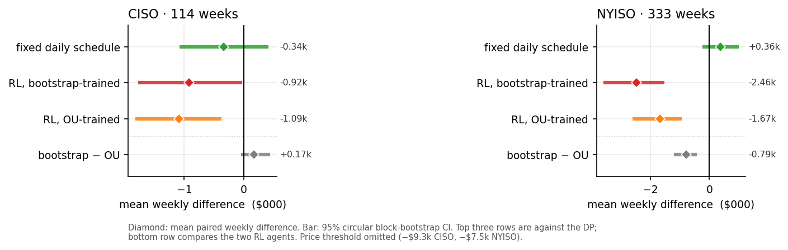
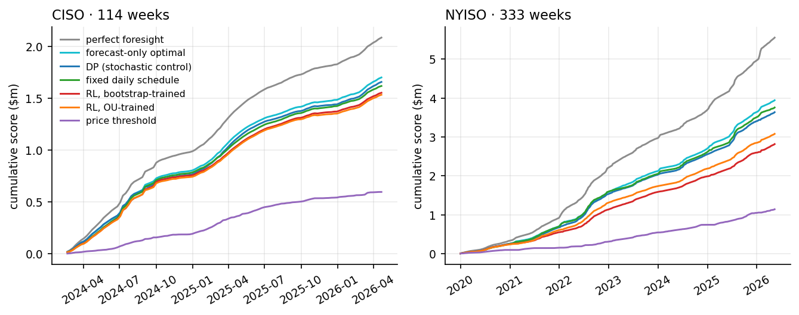
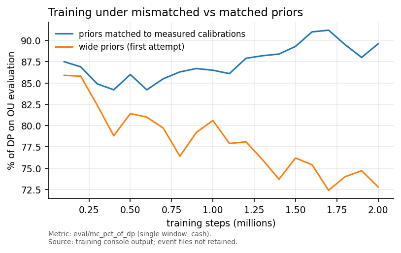
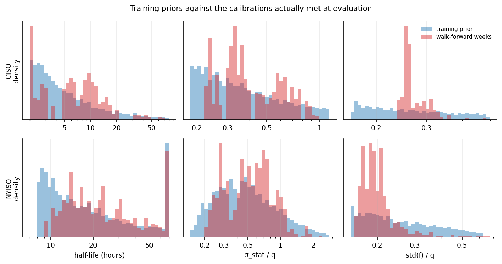

# Battery Storage Dispatch: Stochastic Control vs. Reinforcement Learning

A stochastic optimal control framework for energy storage arbitrage, and a controlled
comparison against model-free reinforcement learning, validated out-of-sample across two
structurally different US electricity markets (CISO and NYISO).

Every method is scored the same way, on the same weeks, through the same simulator. Each
decision that could bias the comparison — the configuration, the scoring rule, the baselines,
the training priors — was registered in `docs/experiments/` before the results existed.

## Results

Weekly score = cash revenue over the scored week + q x energy still stored at its end.
Value capture is that score as a share of perfect foresight. Confidence intervals are paired
weekly differences against the DP, from a circular block bootstrap (10,000 resamples).

### CISO — 114 evaluation weeks

| method | mean weekly score | value capture | Sharpe | vs DP | 95% CI | verdict |
|---|---|---|---|---|---|---|
| perfect foresight | $18,314 | 100% | 1.70 | — | — | ceiling |
| **DP (stochastic control)** | **$14,559** | **79.5%** | **1.47** | — | — | — |
| fixed daily schedule | $14,216 | 77.6% | 1.48 | −$343 (−2.4%) | [−1,082, +407] | inconclusive |
| RL, bootstrap-trained | $13,643 | 74.5% | 1.46 | −$915 (−6.3%) | [−1,776, −34] | underperforms DP |
| RL, OU-trained | $13,472 | 73.6% | 1.44 | −$1,086 (−7.5%) | [−1,823, −380] | underperforms DP |
| price threshold | $5,240 | 28.6% | 1.21 | −$9,318 (−64.0%) | [−11,994, −6,782] | underperforms DP |

### NYISO — 333 evaluation weeks

| method | mean weekly score | value capture | Sharpe | vs DP | 95% CI | verdict |
|---|---|---|---|---|---|---|
| perfect foresight | $16,674 | 100% | 1.29 | — | — | ceiling |
| fixed daily schedule | $11,279 | 67.6% | 1.22 | +$362 (+3.3%) | [−243, +985] | inconclusive |
| **DP (stochastic control)** | **$10,918** | **65.5%** | **1.32** | — | — | — |
| RL, OU-trained | $9,245 | 55.4% | 1.59 | −$1,673 (−15.3%) | [−2,597, −939] | underperforms DP |
| RL, bootstrap-trained | $8,455 | 50.7% | 1.54 | −$2,463 (−22.6%) | [−3,582, −1,519] | underperforms DP |
| price threshold | $3,424 | 20.5% | 1.07 | −$7,494 (−68.6%) | [−9,425, −5,839] | underperforms DP |

RL rows average five seeds. Per-seed differences against the DP span −$1,986 to −$819
(CISO, OU), −$1,422 to −$666 (CISO, bootstrap), −$2,507 to −$879 (NYISO, OU) and
−$3,069 to −$1,921 (NYISO, bootstrap).



### Bootstrap against OU, head to head

Paired on identical weeks, seeds averaged:

| market | bootstrap − OU | 95% CI | bootstrap ahead | verdict |
|---|---|---|---|---|
| CISO | +$171 (+1.3%) | [−51, +442] | 66% of weeks | inconclusive |
| NYISO | −$790 (−8.5%) | [−1,197, −418] | 50% of weeks | bootstrap worse |



## Key findings

**A fixed daily timetable is statistically indistinguishable from the stochastic controller.**
A rule that charges in the four cheapest forecast hours and discharges in the four dearest —
never looking at a realized price — lands within noise of the DP in both markets, and slightly
ahead of it in NYISO. Most of the achievable value is the shape of the average day, and the
entire control problem is fought over the remainder.

**Model-free RL did not beat model-based control.** All four confidence intervals exclude
zero: both variants land below the DP in both markets, and below the schedule baseline too.
The agents are more conservative rather than simply worse — in NYISO they win 99-100% of weeks
at a Sharpe of 1.54-1.59 against the DP's 1.32, giving up upside to avoid bad weeks.

**Training on real price paths did not help.** The bootstrap source replaces simulated prices
with real residual blocks carrying genuine spikes and sustained drift. In CISO the difference
is indistinguishable from zero (+1.3%, CI [−51, +442]); in NYISO it is clearly negative
(−8.5%, CI [−1,197, −418]). The NYISO result matches the limitation registered in advance: the
leakage rule confines the pool to data preceding the first scored week, which there means 2019,
the calmest and cheapest year in the sample.





**The training distribution mattered more than the algorithm.** A first attempt used priors
roughly four times wider than reality in log terms, so only about 12% of training episodes
resembled a real week. Performance peaked at 85.9% of the DP after 100k steps and then decayed
to 72.8% by 2M: the agent was converging on the optimum of the wrong problem. Matching the
priors to the measured calibrations turned the curve around, ending near 91%.

**Three DP-side corrections came out of building the comparison**, worth +5.4% in CISO and
+3.3% in NYISO before any RL was involved. See Methodology corrections.

## Approach

### Price model

Prices decompose as P_t = f(t) + X_t: a deterministic seasonal component and a mean-reverting
residual.

**Seasonal component:** Fourier regression — sine/cosine harmonics at daily and annual
frequencies plus day-of-week dummies. Fewer parameters than a full dummy model (~25 vs ~40),
which produces more stable out-of-sample predictions.

**Stochastic residual:** an Ornstein-Uhlenbeck process, dX_t = theta(mu - X_t)dt + sigma dW_t,
with parameters estimated by maximum likelihood on pseudo-out-of-sample residuals from an inner
split of the training window.

**The mean is predicted, not assumed zero.** Weekly residual levels are strongly persistent
(autocorrelation +0.62 in CISO, +0.61 in NYISO; half-life about 1.4 weeks). The OU mean is set
to a shrunk, clipped estimate of the last training week's level, which predicts about a third
of the variance of the coming week's level.

**Sigma is a predictive standard deviation, not a conditional one.** Calibrating on a
three-month residual window looks like an over-estimate against within-week variation, but a
one-week-ahead control problem needs the variance of a week whose level is unknown. That
decomposes into within-week variation plus the spread of weekly levels — 16.2 in CISO and 33.4
in NYISO against calibrated values of 18.8 and 31.6. Estimating sigma on shorter windows
conditions on information unavailable at decision time, and measurably degrades performance.

### Control problem

A battery with capacity S, maximum rate u and round-trip efficiency eta maximizes expected
revenue. The Hamiltonian is piecewise linear in u, so the optimal control is bang-bang: charge
at full rate, discharge at full rate, or hold. Rather than finite-differencing the HJB, the OU
transition density is discretized and the value function computed by backward induction on a
(price residual x state of charge) grid, so each time step is one matrix multiply.

### Scoring

Every method is scored as cash over hours 0-167 plus q x SOC at hour 168, where q is the
training-window mean price — the terminal value the DP already uses and the RL reward already
shapes toward. Under cash-only scoring the DP beat perfect foresight in 11 CISO weeks and 93
NYISO weeks, because perfect foresight rationally ends weeks holding inventory that cash-only
scoring ignores. Under this rule it never does. Registered in `docs/experiments/scoring_rule.md`.

### Baselines

Both are parameter-free, so nothing is fitted to the evaluation weeks, and each isolates one
source of value: **schedule** knows the typical daily shape but never sees a price, while
**threshold** reacts to price against the value of stored energy but has no sense of timing.
The second is exactly the greedy policy on the RL shaping reward.

### Reinforcement learning

**Environment.** A Gymnasium environment over the same battery dynamics, the same discrete
actions and the same 336-hour episodes the DP plans over, scored on the first 168 hours.
Infeasible actions are masked.

**Information parity.** The agent observes what the DP receives: the price residual, state of
charge, the seasonal forecast and its next-24-hour path, time remaining, and the OU calibration
itself, so one agent covers every walk-forward window instead of retraining weekly. In NYISO it
also observes q, which varies fourfold across weeks there.

**Reward.** Raw revenue, scaled, with potential-based shaping q x SOC. Shaping is provably
policy-invariant and telescopes exactly to the DP's terminal valuation, so it changes the
credit-assignment problem without changing the objective.

**Training sources.** OU-simulated episodes from priors matched to the measured calibration
distributions, and bootstrap episodes that take the path shape from real residual blocks while
drawing scale and calibration labels from the same priors.

**Configuration.** Frozen in `src/config.py` after a registered selection experiment, and used
unchanged for every production run. Production seeds (100-104) are disjoint from the seeds that
chose the configuration.

### Evaluation

Walk-forward with weekly retraining of the price model: a one-year rolling training window, a
one-week evaluation window, a one-week buffer, and no future information in any evaluation week.

The harness is gated. The DP replayed through the RL environment reproduces the original
backtest to floating point in all 447 weeks. Every policy is checked for determinism and for
lookahead — scrambling prices after hour t must not change any action at or before t, and a
deliberately cheating policy is confirmed to fail that check. Any week where a method beats
perfect foresight, or takes a masked action, invalidates the run.

Comparisons are paired weekly differences with a circular block bootstrap, because weekly scores
are autocorrelated (+0.58 CISO, +0.66 NYISO). An i.i.d. interval covers the truth 67-69% of the
time while claiming 95%; the block bootstrap achieves 87-90%.

## Methodology corrections

Three DP-side errors surfaced while building the comparison:

- **State-of-charge lattice mismatch.** Charging moved SOC by 21.25 MWh against a 2.5 MWh grid,
  so the simulator read the policy at states the solver never evaluated.
- **The OU mean was pinned to zero** by demeaning, discarding a predictable and persistent
  weekly level.
- **The price-residual grid was too coarse** for the one-step transition density, which spread
  across roughly three grid points, and occasionally collapsed onto one.

Together: **+5.4% mean weekly revenue in CISO and +3.3% in NYISO.**

Value capture figures in earlier versions of this README used cash-only scoring and were
corrected under the scoring rule above.

## Registered decisions

Each was committed before the results it governs existed:

| document | decides |
|---|---|
| `docs/experiments/PPO_config.md` | PPO configuration, with thresholds and the scoring code fixed in advance |
| `docs/experiments/scoring_rule.md` | how every method is scored, which statistics are reported, what counts as a claim |
| `docs/experiments/baselines.md` | both baselines, parameter-free by construction |
| `docs/experiments/nyiso_setup.md` | NYISO training priors and the q observation |
| `docs/experiments/bootstrap_source.md` | the bootstrap source, and its single-year pool limitation |

## Assumptions and limitations

- Price-taker; no transaction costs, battery degradation, or ramp constraints.
- The OU model has no jumps and no sustained trends. Real CISO residual innovations have excess
  kurtosis of 375 and weekly drift persisting at +0.26, against +0.03 for a fitted OU path.
- Training priors are bounded by percentiles of all walk-forward calibrations, so an early
  evaluation week's agent saw a range partly informed by later data. The DP's mean-reversion
  coefficient has the same mild dependence. Both are disclosed rather than corrected.
- The bootstrap pool is one year, and for NYISO an unrepresentative one.
- Training-time monitoring uses OU cases for both agents, so it flatters neither.

## Structure

    src/
      price_model.py     seasonal fitting, OU estimation
      windows.py         walk-forward window construction (shared by DP and RL)
      optimization.py    transition matrix, backward induction
      simulation.py      forward simulation, walk-forward backtest
      dynamics.py        battery physics, shared by every method
      baselines.py       schedule and threshold rules
      stats.py           paired block-bootstrap comparisons
      config.py          frozen PPO configuration
      rl/
        env.py           Gymnasium environment
        sources.py       OU and replay price sources
        priors.py        market training priors
        bootstrap.py     real-residual training source
        scenarios.py     training environments and evaluation cases
        training.py      SB3 wiring
        evaluate.py      historical evaluation harness
        gates.py         determinism and lookahead checks
    scripts/             training, evaluation, comparison, and check scripts
    docs/experiments/    registered decisions
    results/             per-week scores for every method, with provenance

## Usage

```bash
pip install -r requirements.txt

export MOTHERDUCK_TOKEN="md_..."
python data/extract.py --region CISO
python data/extract.py --region NYIS

# DP backtest and the reproduction gate
python scripts/capture_dp_reference.py
python scripts/check_dp_reproduction.py

# baselines
python scripts/eval_historical.py --market CISO --baseline schedule

# train and score an agent
python scripts/train.py --market CISO --source ou --seed 100
python scripts/eval_historical.py --market CISO --model <model>.zip --name rl_ou_s100

# comparison
python scripts/compare_methods.py
```

## Future directions

- **Degradation costs**, where the DP's state space stops being tractable and RL's flexibility
  would actually pay; the same change makes continuous action spaces meaningful, since bang-bang
  is provably optimal without a convex cost.
- **A two-factor OU model.** The residual decomposes into a fast component (half-life ~11h) and
  a slow one (~240h), which one AR(1) cannot represent; the fitted half-life swings from 2h to
  228h across windows as a result.
- **Certainty-equivalent MPC**, the strongest realistic industry competitor not yet measured.
- **Transaction costs**, to find the level at which the arbitrage stops being viable.
