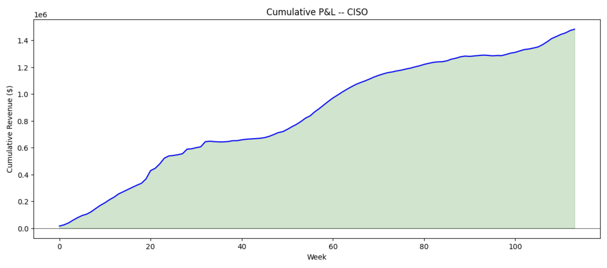

# Optimal Battery Storage Dispatch via Stochastic Control

A stochastic optimal control framework for energy storage arbitrage,
validated out-of-sample across two structurally different US electricity
markets (CISO and NYISO).

## Results

| Metric               | CISO    | NYISO   |
|----------------------|---------|---------|
| Mean weekly revenue   | $13,669 | $10,211  |
| Trimmed Sharpe        | 1.72    | 1.49    |
| Win rate              | 96%     | 98%     |
| Value capture (mean)  | 74%     | 86%     |
| Value capture (ratio) | 82%     | 72%     |
| Eval weeks            | 114     | 333     |



## Approach

### Price Model

Electricity prices are decomposed as $P_t = f(t) + X_t$, where
$f(t)$ is a deterministic seasonal component and $X_t$ is a
mean-reverting stochastic residual.

**Seasonal component:** estimated via Fourier regression — sine/cosine
harmonics at daily and annual frequencies plus day-of-week dummies.
Fewer parameters than a full dummy model (~25 vs ~40), which
produces more stable out-of-sample predictions.

**Stochastic residual:** modeled as an Ornstein-Uhlenbeck process,

$$dX_t = \theta(\mu - X_t)dt + \sigma dW_t$$

Parameters $(\theta, \mu, \sigma)$ are estimated via MLE on
pseudo-out-of-sample residuals using an inner cross-validation
split within the training window, which prevents the OU calibration
from seeing artificially clean in-sample residuals.

The long-run mean μ is set using a persistence forecast: the 
average residual over the final week of the training window, 
shrunk by a factor of 0.6 (estimated independently in both 
markets). This captures the observation that weekly residual 
levels are ~60% autocorrelated — the model reverts toward where 
prices actually are, not toward a historical zero.

### Control Problem

A battery with capacity $\bar{S}$, max charge/discharge rate
$\bar{u}$, and round-trip efficiency $\eta$ chooses actions
$u_t \in [-\bar{u}, \bar{u}]$ to maximize expected revenue:

$$V(t,X,S) = \sup_u \mathbb{E}\left[\int_t^T u_s[f(s)+X_s]ds + q \cdot S_T\right]$$

subject to storage dynamics $dS_t = (-u_t^+ + \eta u_t^-)dt$.

The corresponding HJB equation is:

$$0 = \frac{\partial V}{\partial t} + \theta(\mu-X)\frac{\partial V}{\partial X} + \frac{1}{2}\sigma^2\frac{\partial^2 V}{\partial X^2} + \sup_{u \in [-\bar{u},\bar{u}]} H(t,X,S,u)$$

where $H = u[f(t)+X] + \frac{\partial V}{\partial S}(-u^+ + \eta u^-)$.

The Hamiltonian is piecewise linear in $u$, so the optimal control
is bang-bang — the battery charges at full rate, discharges at full
rate, or holds. This reduces the optimization at each grid point
to evaluating three cases rather than solving a continuous problem.

### Solution Method

Rather than finite-differencing the HJB (which has CFL stability
constraints), the OU transition density is discretized into a
probability matrix and the value function is computed via backward
induction on a (price residual × SOC) grid. Grid spacing is chosen 
so that both charge (η·ū=21.25 MWh) and discharge (ū=25 MWh) 
transitions land exactly on grid points, eliminating interpolation 
error between the policy solver and simulator. The expectation step
reduces to a single matrix multiply per time step.

### Validation

Walk-forward out-of-sample backtesting with weekly retraining:
- 1-year rolling training window
- 75/25 inner split for cross-validated OU estimation
- 1-week evaluation window with 1-week buffer for terminal effects
- Seasonal model and OU parameters re-estimated each iteration

No future information leaks into any evaluation week.

## Key Findings

- **The framework generalizes across markets.** The same pipeline
  produces profitable strategies in both CISO (duck curve driven)
  and NYISO (demand driven) without market-specific tuning.

- **Fourier seasonality outperforms dummies out of sample.** In-sample
  R² and ACF are identical, but Fourier's smoothness constraint
  prevents catastrophic out-of-sample failures (negative R²) that
  plagued the dummy model during market regime shifts.

- **The arbitrage opportunity is declining.** Daily price spreads in
  CISO have roughly halved over the sample period, consistent with
  battery market saturation compressing the duck curve.

- **The OU model's main limitation is sustained price trends.** When
  prices shift to a new level without reverting, the optimizer
  underperforms — it holds positions waiting for a reversion that
  doesn't come. This accounts for most of the gap between the
  strategy's returns and perfect foresight.

## Assumptions

- Price-taker: no market impact from battery actions
- No transaction costs (bid-ask spread, grid fees)
- No battery degradation costs
- No ramp rate constraints

## Implementation Notes

Backward induction is fully vectorized over the (price × SOC) 
grid — each time step evaluates all three candidate actions as 
array operations rather than element-wise loops, yielding ~50-100× 
speedup over the naive implementation.

## Structure

    ├── src/
    │   ├── price_model.py      # Seasonal fitting, OU estimation
    │   ├── optimization.py     # Transition matrix, backward induction
    │   └── simulation.py       # Forward simulation, walk-forward backtest
    ├── notebooks/
    │   ├── 01_exploration.ipynb
    │   ├── 02_model_fitting.ipynb
    │   └── 03_backtest_results.ipynb
    ├── data/
    │   ├── extract.py           # Data extraction from MotherDuck
    │   └── README.md
    └── requirements.txt

## Usage

```bash
pip install -r requirements.txt

# Extract data (requires MotherDuck token)
export MOTHERDUCK_TOKEN="md_..."
python data/extract.py --region CISO
python data/extract.py --region NYIS

# Run notebooks in order
jupyter notebook
```

## Future Directions

- **Jump-diffusion model:** adding compound Poisson jumps to capture
  price spikes the OU model cannot produce
- **Transaction costs:** incorporating bid-ask spreads to determine
  the breakeven cost level
- **Regime-switching:** allowing mean-reversion speed and volatility
  to depend on a latent market state

